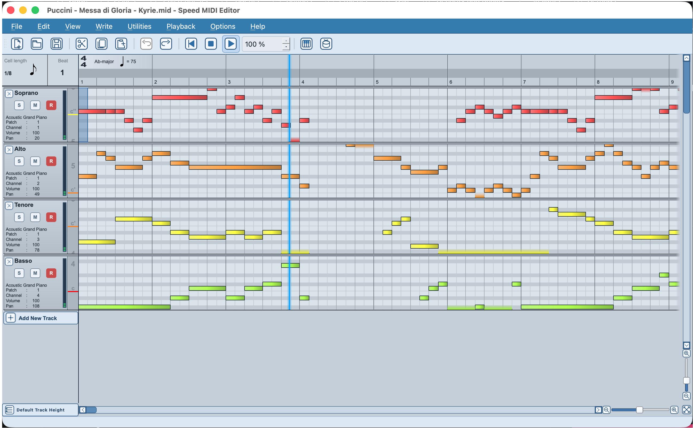

# Speed MIDI Editor

**A simple multi-track editor for standard MIDI files.**



*macOS development preview, captured September 27, 2026.*

Speed MIDI Editor is a community continuation of Speedy MIDI 1.1 by Holger Hoffmann. It keeps the original piano-roll workflow while bringing the application to current Qt and macOS toolchains. It is a MIDI file editor, not a digital audio workstation.

## Download

Download published Windows x64 and macOS Universal 2 packages from [GitHub Releases](https://github.com/RobCZart82/Speed-MIDI-Editor/releases). Each release includes SHA256 checksums. Temporary test packages are also available from [GitHub Actions](https://github.com/RobCZart82/Speed-MIDI-Editor/actions); these are not release downloads.

Because the macOS download has no Apple developer signature or notarization, macOS may warn on first launch. Only use a package downloaded from this project's GitHub Releases page. After attempting to open it, go to **System Settings → Privacy & Security → Open Anyway** and confirm the exception for this app. Apple documents this one-time override in [Open a Mac app from an unknown developer](https://support.apple.com/en-am/guide/mac-help/open-a-mac-app-from-an-unknown-developer-mh40616/mac). This step is not needed for a future signed and notarized build.

## Features

- Multi-track piano-roll editing with note, velocity, and controller workflows
- Standard MIDI File import and export
- MIDI playback and device output, including macOS CoreMIDI destinations
- Track Solo, Mute, and Record controls, a MIDI activity indicator, Fit All Tracks, and equal-height track sizing
- Blue-gray editor theme with a blue toolbar and native macOS window controls

## System requirements

### For users

- macOS Universal 2 is the primary release target: one app for Apple Silicon and Intel.
- The planned minimum macOS version is macOS 13 or newer, matching the Qt 6.10 supported runtime target. This still needs clean-machine verification before release.
- Windows x64 is also being prepared for Windows 10 version 1809 or newer and Windows 11. Windows 11 ARM may run this build through x64 emulation; that configuration needs device/playback testing.
- Use the package attached to a published release; see its notes for tested configurations and limitations.

### To build from source

- CMake 3.21 or newer
- A C99/C++17-compatible compiler
- Qt 6.8 or newer with Widgets, Xml, Network, Svg, and LinguistTools components

Linux build configuration is preliminary and is not a release target. Windows x64 packaging and automated MIDI backend tests pass; Windows 11 Microsoft GM playback has also been manually confirmed. Clean-machine and minimum-OS validation remain incomplete.

## Build from source

Install Qt 6 and CMake, then configure with your Qt installation path. The release workflow uses Qt 6.10.3 and builds a Universal 2 app:

```sh
cmake -S . -B build \
  -DCMAKE_PREFIX_PATH="/path/to/Qt/6.10.3/macos" \
  -DCMAKE_OSX_ARCHITECTURES="x86_64;arm64" \
  -DCMAKE_OSX_DEPLOYMENT_TARGET=13.0 \
  -DCMAKE_BUILD_TYPE=Release
cmake --build build --parallel
```

For a single-architecture development build, set `CMAKE_OSX_ARCHITECTURES` to `arm64` or `x86_64` instead. The current local Universal 2 bundle contains both architectures.

## Development status

The application version is **0.1.0**. CTest covers MIDI/RMID parsing, save/reload, overlapping-note import, clipboard data, MIDI lifecycle and Windows WinMM failures. Both platform workflows run tests before deployment and package verification. Windows 11 x64 Microsoft GM playback and macOS playback/save/reopen have been manually confirmed on the preceding stability build. Minimum-OS, clean-machine and external-hardware coverage remains incomplete; see the [release audit](docs/RELEASE_AUDIT_2026-09-29.md).

Run the automated tests after building:

```sh
ctest --test-dir build -C Release --output-on-failure --no-tests=error
```

Version tags prepare a draft GitHub Release with Windows and macOS ZIPs and SHA256 checksums. A draft is published only after its package checks and release notes have been reviewed.

## About and license

The original Speedy MIDI 1.1 source snapshot is preserved in [`upstream-1.1/`](upstream-1.1/). Speed MIDI Editor and its modifications are licensed under the GNU General Public License, version 3 or any later version ([`GPL-3.0-or-later`](LICENSE)). Original author notices are retained. The upstream project is available on [SourceForge](https://sourceforge.net/projects/speedymidi/).

See [`docs/TECHNICAL_AUDIT.md`](docs/TECHNICAL_AUDIT.md) and [`src/speedymidi/images/README.images`](src/speedymidi/images/README.images) for third-party component and asset notes. Qt is a build dependency and is not included in the source repository.

See [`docs/RELEASE_READINESS.md`](docs/RELEASE_READINESS.md) for the pre-release test matrix and remaining release gates.

## Documentation

- [User guide (English)](docs/USER_GUIDE_EN.md)
- [Felhasználói útmutató (magyar)](docs/USER_GUIDE_HU.md)
- [Technical audit](docs/TECHNICAL_AUDIT.md)
- [Contributing](CONTRIBUTING.md)
- [Changelog](CHANGELOG.md)
